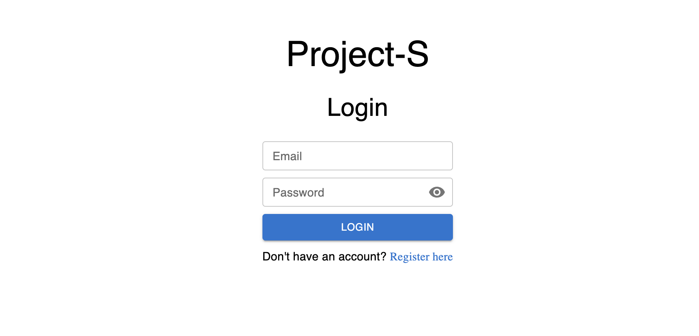

# Project-S
> A MERN-based project management and bug tracking web application designed for software developer teams.
<!-- > Live demo [_here_](https://www.example.com). If you have the project hosted somewhere, include the link here. -->

## Table of Contents
* [General Info](#general-information)
* [Technologies Used](#technologies-used)
* [Features](#features)
* [Screenshots](#screenshots)
* [Project Status](#project-status)
* [Room for Improvement](#room-for-improvement)
* [Feedback](#feedback)
* [Contact](#contact)

## General Information
- This project makes up a part of my current portfolio and was inspired by an interest in learning about the tools and processes used by software developer teams to collaborate on large scale projects.

## Technologies Used
- React
- Material UI
- Day.js
- Chart.js
- Redux
- Axios
- React-router-dom
- Express
- JWT
- Bcrypt
- Cors
- Cookie-parser
- Node
- Mongoose
- MongoDB

## Features
- Register & Login User
- Create & Delete Projects
- Create Tickets (Feature, Bug, Improvement, Task, Test)
- View & Update Personnel Info (Admin Only)

## Screenshots

## Project Status
Project is: _in progress_ 

## Room for Improvement
To do:
- Edit Project
- Bugfix: saving edits for a ticket while in project view won't automatically re-render with updated ticket info 

## Feedback
I am always happy to get feedback so if you have a moment I'd greatly appreciate you filling out a [feedback form](https://forms.gle/KUfVf1iN5LNbMwfw7)! Thanks!

## Contact
Created by [@emilio-fv](https://github.com/emilio-fv) - feel free to contact me!